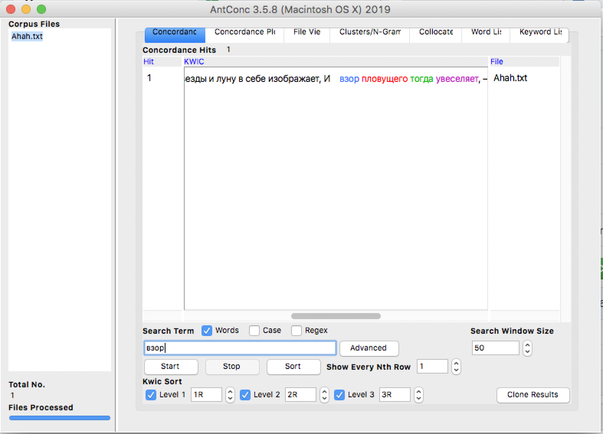

# HW3
задание 1.6
 
 задание 1.4

задание 1.3

задание 1.4

задание 1.4

задание 1.5 

задание 2 устаревшее - бедство, используемое - бедствие
1

2

3

4

задание 2 устаревшее слово - пловущий, используемое - плывущий
1

2

3

4

5

задание 2 устаревшее слово -произвесть, используемое - произвести 
1

2

3

4

5

