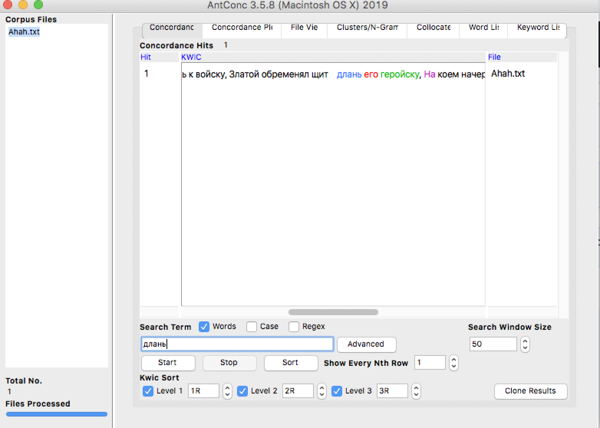

# HW3
задание 1.6
 
 задание 1.4

задание 1.3

задание 1.4

задание 1.4

задание 1.5 

задание 2 устаревшее - бедство, используемое - бедствие

1

2

3

4

5

IPM 
задание 2 устаревшее слово - пловущий, используемое - плывущий

1

2

3

4

5

задание 2 устаревшее слово -произвесть, используемое - произвести 

1

2

3

4

5

Выводы задание 2:
а) у устаревших слов есть схожая по форме используемая замена
б) для подобной работы использовать Google Ngrams удобнее, чем НКРЯ, так как легче разобраться с работой сайта, а также Google Ngrams содержит множество корпусов
IPM:
0,01411273 – плывущий
0,05292275 – пловущий
0,2152192 – бедство
22,7567839 - бедствие
0,00705637 - произвесть
109,666529 -произвести 
Задание 3:
Для понимания текста работа с корпусом не очень помогла, так как слова были известны мне до работы с программами. Однако в работе полученные навыки могут пригодиться, например, при составлении словаря XIX века или при сравнивании различных форм слова. Конечно же, корпусы необходимы, если нужно узнать частоту использования слов, причем Google Ngrams позволяет работать с многочисленными зарубежными текстами.
